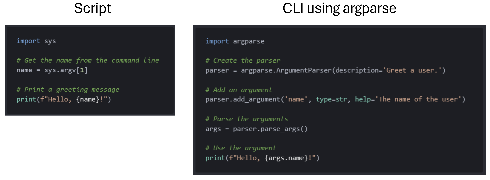

## Creating CLIs with Python

While scripts are valuable tools for automating tasks, Command-Line Interfaces (CLIs) make scripts more powerful and user-friendly, allowing for easier use.

Here are the key differences between scripts and CLIs:

| **Aspect** | **Scripts** | **CLIs** |
|------------|-------------|----------|
| **User Interaction** | Limited, often run with predefined operations or simple input parameters. | Enhanced, with interactive prompts, menus, and more complex input handling. |
| **Parameter Handling** | Basic, typically through command-line arguments or file input. | Dynamic, with support for optional and mandatory arguments, complex command structures, and detailed feedback on incorrect inputs. |
| **Usability & Documentation** | Requires manual documentation, which may not be as accessible to new users. | Often includes built-in help options (`--help`), automatically generating usage documentation and making the tool more user-friendly. |
| **Scalability & Integration** | Designed for specific, standalone tasks; integration into larger workflows can be cumbersome. | Easily integrated into automation pipelines, compatible with other tools, and designed for composability in larger systems. |

In this session, we will use Python's `argparse` library to create user-friendly CLIs. **Argparse** is a simple yet powerful tool that allows creating CLIs with different levels of complexity using minimal code.

As we go through the exercises, you might find some of the code/functions/commands in the [cheatsheet](cheatsheet.md) useful. Let's start!

---

### Creating CLIs with Argparse

**Example**: Create a CLI that takes a name and prints a greeting message. 

To help notice the difference between a script and a CLI, here is a side-by-side comparison of the code that would do the same thing:



Note that, while the code for the script is shorter, it is much less informative - if the script is longer and more complex it will be difficult for a user that is not familiar with the code to interact with it. On the other hand, when we use `argparse`, we can give the input arguments names, and even provide a help text that the user can read and get a better understanding how to run the command and how interact with the code. 

What is the command to run this CLI? Same as the script:
```
python clis/cli_name.py InputValue
```

How to get the help text? Using the `-h` or `--help` flag:
```
python clis/cli_name.py -h
```

<br>

Now it's your turn! :)

<br>

**Exercise**: Create a CLI that takes a number as an argument and prints its square. **Note** that the `type` should be set to a numerical type (i.e. `int` or `float`).

<br>

**Exercise**: Create a CLI, called `add_two_numbers.py`, that takes two numbers, as two separate arguments, and prints the addition.

**Hint**: since we have two inputs, we need to define two arguments in the `add_two_numbers.py`:
```python
# Defining the first argument
parser.add_argument('number1', type=float, help='First input')

# Defining the second argument
parser.add_argument('number2', type=float, help='Second input')

# Parse the arguments
args = parser.parse_args()
```

And we can refer to these in the code as `args.number1` and `args.number2`.

Does it work?

<br>

**Exercise**: There is an script in the `scripts` forlder called `extract_valid_trials.py`. This scripts takes the path to a CSV file that contains trial information from a recording session and saves a new CSV file that only contains the "valid" trials. Can you create the CLI version of it please? Save it in the `clis` folder, and please make sure it works by applying it on the `session.csv` (which is in the `data/raw` folder).

<br>

**Exercise**: There are two scripts in the `scripts` forlder called `normalize_array.py` and `standardize_array.py`. Can you combine their functionality into a single CLI, called `transform_array.py`? With this CLI, the user can pass their desired transformation as an additional input argument. Please make sure the transformation is reflected in the name of the output file. Appply it on the `array.npy` file in the `data/raw` folder. Does it work?

<br>

**Keep track of the development**: We have ceated some new files, let's commit the changes (with a short message) and push to GitHub.

---

### CLIs with Optional Arguments

So far we have created CLIs where there is a specific number of arguments, and the CLI only runs if we specify a value for all the arguments. What if we want our CLI to run even if some arguments were not assigned a value by the user? These are "optional" arguments.

Creating optional arguments for your CLI, is very similar to how we did it before, but we add a `--` before the name of the argument, and also specify a `default` value (in case nothing was specified by the user). Here is an example:

```python
# Defining an optional argument
parser.add_argument('--group', type=str, default="iBehave", help='Research group the scholar is a member of.')
```

<br>

Let's practice this a bit.

<br>

**Exercise**: Change the `add_two_numbers.py` CLI such that the user can also optionally scale the output (default scale is `1`).

<br>

**Exercise**: Change the `transform_array.py` CLI such that the the operation argument is optional (default operation is to standardize).

<br>

**Exercise (optional)**: Change the `extract_valid_trials.py` CLI such that we can extract valid trials for a specific subject (by specifying the `subject_id`)? By default (i.e. when `subject_id` is not specified) all subjects are included. Please make sure the file name reflects the `subject_id` too.

<br>

**Keep track of the development**: We have ceated some new files, let's commit the changes (with a short message) and push to GitHub.

---

### Running CLIs in Jupyter Notebooks

And of course, we can also run our CLIs in Jupyter Notebooks. To do this we can simply use the `!` operator to run the CLI in a code cell:

```python
!python greet_user.py Mo --group=iBOTS
```

**Example**: For an example please see (and run) the `greet_user_cli_demo.ipynb` in the `notebooks` directory.

<br>

**Exercise**: Using a Jupyter notebook, show that the `transform_array.py` CLI does work properly:
- Create a jupyter notebook (a file with `.ipynb` extension) in the `notebooks` folder
- Within this notebook, we want to use the CLI and make sure it does the correct transformation:
    - When using the CLI to normalize the data, is the resulting output file correctly transformed? i.e. is the value of data min 0 and max 1?
    - When using the CLI to standardize the data, is the resulting output file correctly transformed? i.e. is the value of data mean 0 and standard deviation 1?

<br>

**Exercise**: Within the same notebook, let's also test the `extract_active_trials.py` CLI.
- Deos it correctly extract the active trials?
- Which subject had the highest number of correct response (i.e. `response=1`) for valid trials?

<br>

**Keep track of the development**: We have ceated some new files, let's commit the changes (with a short message) and push to GitHub.

---

### [BONUS] One CLI for different tasks: Creating sub-commands

It could be that, depending on the CLI, we want to package mulitple commands into a single CLI such that people can choose what specific command they would like to use depending on their usecase. This would require us to create "sub-commands" and we can do this with `argparse`. So far, we simply created a parser object and added arguments to it. Now that we want to have multiple commands, we need to create and add "sub-parsers" first (one sub-parser is a sub-command) and then add arguments to that. Here is an example where the `greet_user.py` is extended such that we have one sub-command for greeting and another for farewell:

```python
import argparse

# Create the parser
parser = argparse.ArgumentParser()

# Create a subparser object (we will be adding parsers to this object, basically creating sub-parsers)
subparsers = parser.add_subparsers(dest='command', help='Commands', required=True)

# Sub-command for greeting
greet_parser = subparsers.add_parser('greet', help='Greet the user')
greet_parser.add_argument('name', type=str, help='The name of the user')
greet_parser.add_argument('--group', type=str, default="iBehave", help='Research group the scholar is a member of.')

# Sub-command for farewell
farewell_parser = subparsers.add_parser('farewell', help='Say farewell to the user')
farewell_parser.add_argument('name', type=str, help='The name of the user')

# Parse the arguments
args = parser.parse_args()

# Use the arguments and run the corresponding code based on the command
if args.command == 'greet':
    print(f"Hello, {args.name}! {args.name} is from {args.group}.")
elif args.command == 'farewell':
    print(f"Goodbye, {args.name}!")
```

And we can now run this either to greet someone:
```
python clis/greet_or_farewell.py greet Mo --group=iBOTS 
```
or to say goodbye:
```
python clis/greet_or_farewell.py farewell Mo
```

<br>

**Exercise**: Change the `transform_array.py` CLI such that the transformation is instead specified via subcommand (as opposed to an input argument). In other words, we would like to run the command as follows:
```
python cli/transform_array.py standardize path/to/input_array path/to/transformed_array
```
Or
```
python cli/transform_array.py standardize path/to/array path/to/transformed_array
```